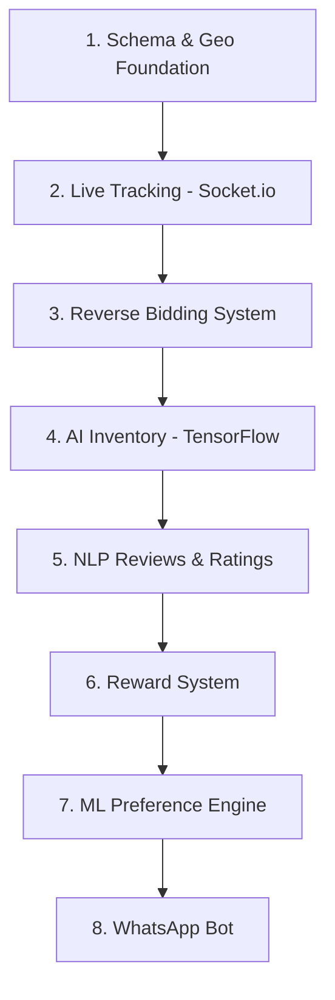

# Tech Thela AI — Repository Audit & Integration Roadmap

---

## PHASE 1: Repository Audit

### Tech Stack Found
| Layer | Technology |
|---|---|
| Framework | Next.js 13.4.7 (Pages Router) |
| Database | MongoDB via Mongoose 7.3 |
| Auth | Firebase Authentication (Google Sign-In), bcrypt (vendor phone+password) |
| Payments | Stripe (checkout sessions + payment intents) |
| UI | TailwindCSS, MUI, HeadlessUI, Framer Motion, Swiper |
| AI/ML (dep only) | `@tensorflow-models/coco-ssd` (installed but **unused**) |
| Chatbot | `react-best-chatbot` (rule-based, not AI) |

### Models
| Model | Fields | Purpose |
|---|---|---|
| `User` | firstName, address, email, pincode, password, isuser, credit | Consumer |
| [Vendor](file:///d:/SIH-Wekreta-master/pages/Vendorlogin.jsx#7-203) | firstName, pincode, phone, password, isuser, credit, cart (Array) | Street vendor |
| `Enterprise` | firstName, phone, password, employee[] (Vendor refs) | Enterprise manager |
| `Reviews` | vendornumber, email, name, msg | Customer review |
| [Revi](file:///d:/SIH-Wekreta-master/components/Review.jsx#6-162) | msg | Simple message store |

> [!WARNING]
> **No geolocation fields** (`lat`, `lng`, `location: { type: "Point" }`) exist on any model. No `2dsphere` index exists. This means all location features are non-functional.

---

### ✅ FEATURES IMPLEMENTED (or Partially)

#### 1. Vendor Features

| Feature | Status | What Exists | What's Missing |
|---|---|---|---|
| **Cart Image Upload UI** | ⚠️ Partial | [UpdateCart.tsx](file:///d:/SIH-Wekreta-master/components/UpdateCart.tsx) — file upload area with Upload/Cancel buttons | **No TensorFlow processing.** `coco-ssd` is a dependency but never imported or used. No API route to process the image. No auto-detection of items. |
| **Demand Prediction** | ⚠️ Partial | [LocateCustomer.js](file:///d:/SIH-Wekreta-master/components/LocateCustomer.js) — sends pincode+day+time to an **external Replit API** and displays a "probability" percentage | **External API is hardcoded** to a Replit URL that may be offline. No local ML model. Static Google Maps embed (not interactive). No real heatmap or live demand map. |
| **Reviews for Vendors** | ⚠️ Partial | [Review.jsx](file:///d:/SIH-Wekreta-master/components/Review.jsx) + [/api/reviews.js](file:///d:/SIH-Wekreta-master/pages/api/reviews.js) — customers can submit text reviews. Reviews are displayed in vendor/enterprise dashboards. | **No NLP processing.** No sentiment analysis. No star ratings. No conversion of reviews to subscription discounts or platform visibility scores. |
| **Leaderboard** | ⚠️ Partial | [Leaderboard.tsx](file:///d:/SIH-Wekreta-master/components/Leaderboard.tsx) — static HTML table with **hardcoded** vendor names and ratings | **Not data-driven.** Not connected to any DB query or rating aggregation. |
| **Enterprise Dashboard** | ✅ Mostly Done | [Enterprise/[slug].tsx](file:///d:/SIH-Wekreta-master/pages/Enterprise/%5Bslug%5D.tsx) — add/remove vendors, view reviews, statistics (Pie, StackedBar, MultiLine charts) | Charts use **hardcoded demo data** (not real metrics from DB). |

#### 2. Consumer Features

| Feature | Status | What Exists | What's Missing |
|---|---|---|---|
| **Customer Dashboard** | ✅ Mostly Done | [Customer.tsx](file:///d:/SIH-Wekreta-master/pages/Customer.tsx) — sidebar with "Vendors Near Me", "Leaderboard", "Review" tabs. Static map embed. Events section filtered by pincode. | |
| **Onboarding Form** | ⚠️ Partial | [form.tsx](file:///d:/SIH-Wekreta-master/pages/form.tsx) — asks family size, youngest/oldest age | **No ML model.** Data is collected but never processed or sent to any API. No buying-frequency prediction. |
| **QR Code Scanning** | ⚠️ Partial | [Review.jsx](file:///d:/SIH-Wekreta-master/components/Review.jsx) uses `react-qr-scanner` to scan vendor QR codes | Works as a UX flow for identifying vendors before reviewing. |
| **Credit Points** | ⚠️ Partial | `credit` field exists on both `User` and [Vendor](file:///d:/SIH-Wekreta-master/pages/Vendorlogin.jsx#7-203) models | **No logic anywhere** to increment credits on review submission or redeem them for coupons. |
| **Pricing Pages** | ✅ Done | [customerpricing.tsx](file:///d:/SIH-Wekreta-master/pages/customerpricing.tsx) (Free + ₹120/mo Pro), [vendorpricing.tsx](file:///d:/SIH-Wekreta-master/pages/vendorpricing.tsx) (₹10/day) | |
| **Payment Integration** | ✅ Done | Stripe checkout sessions + payment intent API routes | |

#### 3. Auth & Core Infrastructure

| Feature | Status | Notes |
|---|---|---|
| **Vendor Login/Signup** | ✅ Done | Phone + password (bcrypt). Auto-creates vendor if not found. |
| **Customer Login** | ✅ Done | Firebase Authentication (Google Sign-In) → redirects to onboarding form. |
| **Enterprise Login** | ✅ Done | Phone + password via [/api/enterprise/login.js](file:///d:/SIH-Wekreta-master/pages/api/enterprise/login.js). |
| **Chatbot** | ⚠️ Partial | Rule-based `react-best-chatbot` with 3 canned options (Login Issue / General / Payment). **Not AI-powered.** |

---

## PHASE 2: Integration Roadmap

### Priority Order (recommended build sequence)



---

### 1. Schema & Geolocation Foundation

**Goal:** Add GeoJSON location fields to User & Vendor models + `2dsphere` indexes.

**Steps:**
1. Update [Vendor.js](file:///d:/SIH-Wekreta-master/models/Vendor.js) schema — add `location: { type: { type: String, default: 'Point' }, coordinates: [Number] }`, `isActive: Boolean`, `inventory: [{ item, qty, price }]`, `rating: Number`
2. Update [User.js](file:///d:/SIH-Wekreta-master/models/User.js) schema — add `location: { type: { type: String, default: 'Point' }, coordinates: [Number] }`, `subscription: { type: String, enum: ['free', 'pro'] }`, `preferences: Object`
3. Create `2dsphere` index on both: `VendorSchema.index({ location: '2dsphere' })`
4. Create API route `pages/api/vendor/update-location.js` — accepts `lat, lng`, updates vendor location
5. Add browser Geolocation API on both dashboards to capture coordinates

**New packages:** None (Mongoose supports GeoJSON natively)

---

### 2. Live Tracking with Socket.io

**Goal:** Real-time vendor location broadcasting + consumer live tracking view.

**Steps:**
1. Install `socket.io` and `socket.io-client`
2. Create a custom Next.js server (`server.js`) with Socket.io attached
3. Create Socket events: `vendor:location-update`, `consumer:track-vendor`, `vendor:go-online`, `vendor:go-offline`
4. Vendor dashboard: emit location via `navigator.geolocation.watchPosition()` every 5s
5. Consumer dashboard: replace static Google Maps iframe with a **Leaflet.js** or **Google Maps JavaScript API** interactive map showing live vendor pins
6. Free users: see "verified vendor nearby" notifications. Pro users: see exact location + direct chat.

**New packages:** `socket.io`, `socket.io-client`, `leaflet` / `react-leaflet` (or `@react-google-maps/api`)

**Schema:** Add `socketId` field to Vendor for active connection tracking

---

### 3. On-Demand Reverse Bidding System (X-Factor)

**Goal:** Consumer creates a "ping" → geofenced vendors get alerted → first to accept wins.

**Steps:**
1. Create new model `models/Ping.js`:
   ```js
   { consumer: ObjectId, item: String, quantity: String,
     location: { type: 'Point', coordinates: [Number] },
     status: 'pending' | 'accepted' | 'completed' | 'expired',
     acceptedVendor: ObjectId, createdAt (TTL: 10min) }
   ```
2. Create API `pages/api/ping/create.js` — consumer submits item + location
3. Create API `pages/api/ping/accept.js` — vendor accepts a ping
4. **Geofencing query:** use MongoDB `$nearSphere` with `$maxDistance: 1000` (meters)
5. Socket.io event: when ping created → query nearby vendors → emit `ping:new-demand` to their sockets
6. When vendor accepts → emit `ping:accepted` to consumer with vendor details + start live tracking
7. Consumer UI: "Request Item" button → form for item + quantity → auto-captures GPS
8. Vendor UI: real-time alert card with "Accept" button showing item, distance, and consumer location

**Schema update:** `2dsphere` index on Ping.location

---

### 4. AI-Powered Inventory (TensorFlow Image Processing)

**Goal:** Vendor uploads cart photo → TensorFlow detects items → auto-populates inventory.

**Steps:**
1. Create API route `pages/api/vendor/scan-cart.js`
2. Use `@tensorflow/tfjs-node` on the server side
3. **Recommended approach:** Use Google Cloud Vision API (more accurate for produce than coco-ssd)
4. Update [UpdateCart.tsx](file:///d:/SIH-Wekreta-master/components/UpdateCart.tsx) — after upload, display detected items with editable quantities
5. Save confirmed items to `Vendor.cart` array

**New packages:** `@google-cloud/vision` OR `@tensorflow/tfjs-node`, `multer` / `formidable` for file uploads

---

### 5. NLP Reviews & Rating System

**Goal:** Analyze review sentiment → compute a score → affect vendor visibility.

**Steps:**
1. Install `compromise` (lightweight NLP) or use Google Cloud Natural Language API
2. Update [Reviews.js](file:///d:/SIH-Wekreta-master/models/Reviews.js) schema — add `sentiment: { score: Number, label: String }`, `rating: Number` (1-5 stars)
3. Update [pages/api/reviews.js](file:///d:/SIH-Wekreta-master/pages/api/reviews.js) — after saving review, run sentiment analysis on `msg`, save `sentiment.score` (-1 to 1) and `sentiment.label` (positive/negative/neutral)
4. Create API `pages/api/vendor/rating.js` — aggregates all reviews for a vendor → computes weighted rating
5. Update Leaderboard to be **data-driven** — query vendors sorted by aggregate rating
6. **Subscription discount logic:** vendors with rating > 4.5 get auto-applied discount flags
7. Update Review.jsx — add star-rating UI component

**New packages:** `compromise` or `@google-cloud/language`, a star-rating React component

---

### 6. Reward System (Credit Points)

**Goal:** Customers earn credits for reviews, redeem for coupons.

**Steps:**
1. Create new model `models/Coupon.js`: `{ code, discount, minSpend, expiresAt, usedBy }`
2. Create API `pages/api/user/earn-credits.js` — called after review submission, adds 10 credits
3. Create API `pages/api/user/redeem-credits.js` — 100 credits = ₹20 coupon → generates coupon code
4. Update [pages/api/reviews.js](file:///d:/SIH-Wekreta-master/pages/api/reviews.js) — after saving review, call earn-credits logic
5. Add "My Credits" section to Customer dashboard showing balance + earned history
6. Add "Redeem" button that converts credits to downloadable/applicable coupon

**Schema:** User model needs `creditHistory: [{ amount, reason, date }]`

---

### 7. ML-Driven Preference Prediction

**Goal:** Use onboarding data to predict buying frequency + product preferences.

**Steps:**
1. Create a simple prediction model (can be rule-based initially, ML later)
2. Create API `pages/api/user/predict-preferences.js`
3. Update [form.tsx](file:///d:/SIH-Wekreta-master/pages/form.tsx) onSubmit → call prediction API → store result in User.preferences
4. Use preferences to sort/filter vendors on the customer dashboard
5. For a production ML model: collect purchase history data → train a TensorFlow.js model for collaborative filtering

---

### 8. WhatsApp Bot Integration

**Goal:** Vendors receive demand alerts on WhatsApp + can upload cart photos via WhatsApp.

**Steps:**
1. Sign up for **WhatsApp Business API** via Twilio or Meta Cloud API
2. Install `twilio` npm package
3. Create webhook endpoint `pages/api/whatsapp/webhook.js` — handles incoming messages
4. **Vendor notification flow:** When a reverse-bidding ping is created → send WhatsApp template message to nearby vendors
5. **Cart photo flow:** Vendor sends a photo via WhatsApp → passes to Vision/TF API

**New packages:** `twilio`

---

### Summary: New Dependencies to Install

```bash
npm install socket.io socket.io-client react-leaflet leaflet
npm install @google-cloud/vision
npm install compromise
npm install twilio
npm install multer
```

### Summary: Database Changes Required

| Model | New Fields |
|---|---|
| **Vendor** | `location` (GeoJSON Point + 2dsphere), `isActive`, `socketId`, `rating`, `inventory[]` |
| **User** | `location` (GeoJSON Point), `subscription`, `preferences`, `creditHistory[]` |
| **Reviews** | `sentiment: { score, label }`, `rating` (1-5) |
| **Ping** [NEW] | `consumer`, `item`, `quantity`, `location` (2dsphere), `status`, `acceptedVendor`, TTL |
| **Coupon** [NEW] | `code`, `discount`, `minSpend`, `expiresAt`, `usedBy` |

---

> [!IMPORTANT]
> **PHASE 3: Awaiting your command.** Tell me which missing feature to build first and I will generate production-ready code for it.
